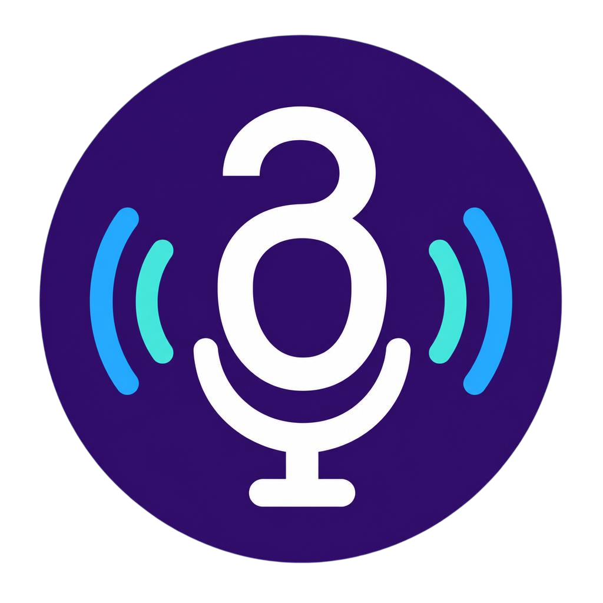

<p align="center">
  
</p>

<h1 align="center">GELA</h1>

<p align="center">Offline Georgian voice control for Windows</p>

[](https://github.com/Beardicuss/GELA/actions/workflows/tests.yml)
[](https://github.com/Beardicuss/GELA)
[](LICENSE.md)

Offline Windows voice controller using Vosk for the always-on wake gate and INT8 Omnilingual ASR for short commands.

Gela is designed and developed by [Softcurse Systems](https://softcurse-website.pages.dev/).

GELA is intentionally a short-command computer controller, not a conversational
assistant. Speech recognition and normal computer control remain local.

## Project documentation

- [Commands](COMMANDS.md)
- [Installation](INSTALL.txt)
- [Architecture](docs/ARCHITECTURE.md)
- [Testing](docs/TESTING.md)
- [Roadmap](ROADMAP.md)
- [micro:bit expansion plan](docs/MICROBIT_ROADMAP.md)
- [Contributing](CONTRIBUTING.md)
- [Security policy](SECURITY.md)
- [Changelog](CHANGELOG.md)
- [License](LICENSE.md)
- [Third-party notices](THIRD_PARTY_NOTICES.md)

## Phase 1 setup

```powershell
.\scripts\setup_dev.ps1
.\scripts\download_models.ps1
```

Use a regular Python 3.11–3.13 installation from python.org. Microsoft Store Python is intentionally rejected because Windows redirects its `%LOCALAPPDATA%` access into a package-specific cache, which would separate development settings and catalogs from the installed Gela application.

List input devices and run the environment diagnostic:

```powershell
.\.venv\Scripts\voice-assistant.exe list-mics
.\.venv\Scripts\voice-assistant.exe doctor
```

`doctor` briefly opens the configured microphone and reads real audio samples. Windows may ask for microphone permission the first time.

The preferred microphone is matched by name in `config/settings.json`; matching ignores spaces and letter case. If Windows reports a different device name, copy the identifying part from `list-mics` into that setting.

Offline recognition models are stored under `models/`. Omnilingual ASR runs only after Vosk accepts `გელა`; it is not used for conversation or autonomous decisions.

## Application catalog and voice launching

Refresh the allowlisted catalog after installing or removing applications:

```powershell
.\.venv\Scripts\voice-assistant.exe scan-apps
.\.venv\Scripts\voice-assistant.exe apps chrome
```

Test a launch without voice:

```powershell
.\.venv\Scripts\voice-assistant.exe open "Google Chrome"
```

Listen once and launch the recognized application:

```powershell
.\.venv\Scripts\voice-assistant.exe listen --language en --seconds 6
```

Say `open`, `launch`, `start`, or `run`, followed by a catalog name. Georgian command prefixes are available with `--language ka`; registered English product aliases can also be resolved alongside Georgian launch, close, focus, minimize, maximize, and restore verbs in background mode.

Georgian aliases are stored in `config/aliases.json`. Examples include `გახსენი ქრომი`, `ჩართე თამაშების ბიბლიოთეკა`, `გაუშვი ელდენ რინგი`, and `გახსენი კალკულატორი`. Run `scan-apps` after editing aliases so they are merged into the generated catalog. Aliases for applications no longer detected are moved to `config/alias_archive.json`, not deleted, and are restored automatically if the exact application returns.

Background voice launches are verified before Gela plays the success response. Known application/game processes must appear and remain stable briefly; Store and launcher-based applications may be verified through a stable matching or newly visible window. Normal applications have a 12-second verification window and Steam games have 45 seconds for launcher/anti-cheat startup. A dispatch with no matching evidence produces the failure response. Complete-close actions likewise verify that known or window-discovered processes exited.

State awareness prevents redundant operations. An open request is skipped when the catalog process or matching window is already running; a complete-close request reports an already-stopped state when neither process nor window exists. Wi-Fi and Bluetooth controls check the current radio state before requesting a change. Diagnostics records `Already running`, `Already stopped`, `Already on`, or `Already off`. Optional reusable WAV events for these four states fall back to the existing `შესრულებულია.` response until their files are recorded.

After a verified launch, Gela conservatively learns a stable process that appeared for that catalog application. Learned mappings are stored in `%LOCALAPPDATA%\Gela\config\learned_process_targets.json`, survive upgrades, and are available immediately to complete-close and named-window commands. Window-based learning requires both a matching application title and a newly started owning process; shared Windows hosts and shell processes are rejected.

Steam game launches maintain a live lifecycle record in `%LOCALAPPDATA%\Gela\runtime\game_lifecycle.json`. Shared launcher processes, temporary anti-cheat/bootstrap processes, and verified gameplay processes are recorded in separate roles. Only a real gameplay process or matching game window can verify launch success, and complete-close commands exclude Steam, Steam Web Helper, overlays, and anti-cheat bootstrappers from the game target.

Verified English product aliases are stored in `config/english_aliases.json`. For safety, every background command requires the exact Georgian wake prefix `გელა`, either in the same continuous utterance or through the two-stage `გისმენ` handshake. No command recognition or launching occurs without that wake prefix.

One-sentence mode can be enabled or disabled under **ძირითადი** in Gela's settings and is enabled by default for new installations. It accepts forms such as `გელა გახსენი ქრომი`, `გელა გახსენი მისტფოლი`, and `გელა ჩართე Steam`. Vosk validates the exact wake prefix; Omnilingual ASR then transcribes the bounded utterance. Execution still requires an exact fixed command or registered catalog target. An unclear combined command falls back to the normal `გისმენ` second stage instead of being guessed.

The legacy `audit-vocabulary` command can still inspect Vosk's wake-model vocabulary, but command aliases are open-vocabulary and are not rejected merely because Vosk lacks a word.

## Background wake-word mode

The default background language is Georgian and the wake phrase is `გელა`. Say the wake phrase by itself, wait for the `გისმენ` response, and then say the command; when one-sentence mode is enabled, the command may immediately follow the exact wake prefix. Sleeping mode uses open-vocabulary Georgian decoding so unrelated speech is not forced into the wake word, and activation always requires an exact wake prefix above the configured confidence threshold.

Enable silent post-login startup:

```powershell
.\.venv\Scripts\voice-assistant.exe install-startup
```

The worker uses `pythonw.exe`, so it has no console window. Runtime information and recoverable errors are written to `logs/assistant.log`. Disable automatic startup with `voice-assistant uninstall-startup`.

The startup entry launches the Gela system-tray application. Its menu shows live state and provides pause/resume, catalog refresh, response tests, logs/settings/catalog shortcuts, startup control, and clean exit. Run it manually with `.\.venv\Scripts\pythonw.exe -m voice_assistant.tray`.

Personal configuration and runtime files are stored under `%LOCALAPPDATA%\Gela`, separate from application binaries. First launch copies existing/default settings, aliases, and catalog without overwriting files already present. The tray menu can open this data folder directly.

Gela automatically rescans installed Start-menu applications and Steam games once at startup and then every hour. Content-aware atomic updates avoid reloading the speech recognizer when nothing changed. Automatic maintenance can be enabled or disabled from the tray; the choice is saved in `config/settings.json`.

Choose **Manage voice aliases** from the tray to open the searchable alias editor. Omnilingual ASR allows Georgian and English aliases outside Vosk's dictionary; duplicates across applications are still rejected. Saving rebuilds the catalog and the running worker reloads it automatically.

Choose **მეტყველების ამოცნობის ტესტი** from the tray to release the worker microphone and test one four-second sample against both offline models. The window shows Georgian and English text with word-level confidence and can promote the selected result to a catalog alias. Promotion requires at least 0.5 confidence, an exact catalog application, vocabulary support, and no cross-application conflict. Test audio is never written to disk; closing the window returns the microphone to the background worker.

Choose **აპლიკაციების მართვის პროფილები** from the tray to configure one catalog entry at a time. A profile can override inferred executable processes, add window-title match fragments, edit Georgian and English aliases, and select automatic close, graceful-only close, or window-only close. Profile processes are limited and validated against unsafe Windows hosts; alias vocabulary and cross-application ownership are validated before all profile files are saved transactionally. Profiles live in `%LOCALAPPDATA%\Gela\config\app_profiles.json` and override automatic guesses only for their selected application.

Reliability settings in `config/settings.json` control wake/command confidence and adaptive voice-activity detection. Real command recordings can be checked offline with `voice-assistant test-command-audio <file.wav> --language ka`; test WAV files must be mono, 16-bit PCM at 16 kHz.

The audio stream checks its selected device every five seconds, reopens after a Windows sleep/resume gap, and falls back to the current default input when the preferred microphone is unavailable. Recovery retries reuse the loaded wake and command models and rate-limit microphone-error responses.

Choose **Diagnostics** from the tray to view Gela's current state, active microphone, model and catalog health, latest wake/command confidence, and latest execution result. This is a single live snapshot rather than command history. The window also provides a microphone test and shortcuts to logs and the Gela data folder.

Choose **Calibrate wake word** to measure three seconds of normal room noise and record five temporary examples of `გელა`. Recordings are analyzed in memory and are not saved. A recommendation is enabled only when at least three samples match exactly; conservative minimum thresholds prevent calibration from making false activation easier.

Uncertain, low-confidence, or competing command matches never execute. Gela plays the existing `ვერ გავიგე. კიდევ ერთხელ მითხარი.` response and listens for one retry without maintaining per-application voice recordings.

After the first rejected command, Gela now listens one more time without requiring `გელა` again. A second rejection produces a short error beep and returns to wake-word mode. `command_retry_attempts` in the background settings controls this bounded behavior and defaults to one.

Any recorded response can be stopped immediately with **Stop voice response** in the tray; pausing or exiting Gela also cancels playback. Speech-triggered barge-in is intentionally deferred because reliable use with room speakers requires acoustic echo cancellation—simple microphone-level detection would make Gela react to its own voice.

Safe system actions include known-folder access, volume controls, screenshots, Windows locking, fixed shutdown/restart/standby requests, and complete application-catalog closing. Gela requests normal closure first, preserves processes showing a visible unsaved-work/confirmation dialog, and stops only background remnants after an app retreats to the tray. See `COMMANDS.md`. Arbitrary shell execution and deletion are not supported.

Applications with explicit or inferred executable mappings also support focus/switch, minimize, maximize, and restore commands. Active-window minimize, maximize, and restore commands use the current foreground window only.

Additional reversible Windows commands open fixed Settings pages, show the desktop, Quick Settings, notifications, or Task View, and adjust supported-monitor brightness by 10 percentage points. Recognized speech is never passed into a URI or shell command.

Global media commands provide play/pause, stop, next track, and previous track through fixed Windows media keys. They work with media applications that register for those system controls.

The tray's **Manage routines** editor creates Georgian or English phrases that launch an ordered group of 1–10 allowlisted catalog applications. Routine definitions live in `%LOCALAPPDATA%\Gela\config\routines.json`, survive upgrades, validate command conflicts, and reload the worker automatically after saving.

Deterministic local intent expansion supports polite Georgian/English fillers, common Georgian verb-final word order, and English open/launch/start forms. Generated phrases never override an exact command, conflicting generated interpretations are discarded, and application targets still come exclusively from the catalog and user aliases.

Optional local question answering is disabled by default and isolated from normal command recognition. It uses a localhost-only Ollama-compatible `/api/generate` endpoint; remote endpoints are rejected. Configure the model under `question_answering` in `%LOCALAPPDATA%\Gela\config\settings.json`, start the local model service, and enable **Local question answering** from the tray. Say `გელა`, then `კითხვა მაქვს`, wait for the second `გისმენ`, and ask the question. Gela recognizes the free-form Georgian or English question, displays one bounded answer in a copyable window, and overwrites the previous runtime answer rather than keeping question history. Generated answers are intentionally not spoken, avoiding dynamic TTS and extra recorded voice variations.

Optional online modules for current weather and Wikipedia lookup are independently disabled by default. They can be enabled under **Online services** in the tray. Weather uses fixed Open-Meteo HTTPS APIs and configured coordinates; Wikipedia lookup uses only Georgian or English Wikimedia HTTPS endpoints. No arbitrary service URL, application data, command catalog, or passive microphone audio is uploaded. See `COMMANDS.md` for phrases and configuration.

## Windows release

Build the standalone, windowless Windows package with:

```powershell
.\scripts\build_release.ps1
```

The script runs the test suite, creates `dist\Gela\Gela.exe`, bundles both offline models and all runtime assets, then writes `release\Gela-Windows-x64.zip`. Extract the complete `Gela` folder before running it; `Gela.exe` depends on its adjacent `_internal` folder. Python does not need to be installed on the destination PC.

For the normal installed release, run `scripts/build_installer.ps1`. It creates `release/Gela-Setup-1.5.2-x64.exe`, a per-user installer with Start-menu integration, optional desktop and sign-in shortcuts, and no administrator requirement. Running a newer installer with the same stable application ID performs an upgrade in place; binaries are replaced while `%LOCALAPPDATA%\Gela` settings, aliases, profiles, routines, and logs remain untouched.

Uninstall from Windows Settings or the Start menu. The uninstaller asks whether to remove personal Gela data and defaults to preserving it. Choose removal only when a complete reset is intended. Public releases are built with `scripts/build_installer.ps1 -RequireSigning` after configuring `GELA_SIGNING_THUMBPRINT`; the pipeline requires SHA-256 Authenticode signatures, an RFC 3161 timestamp, and successful verification for both the application and installer. See `SIGNING.md`. Until a trusted Softcurse Systems certificate is supplied, local builds remain unsigned and Windows SmartScreen may show an unknown-publisher warning.

Each installer build also writes `release-manifest.json` and `SHA256SUMS.txt` so published installer and portable downloads can be verified before an upgrade. There is no unattended network updater without a trusted release host; updates are deliberately installed by running the newer versioned setup executable.

The tray opens native Georgian Settings and Logs windows. Settings are organized into general, microphone, recognition, and service tabs and are validated before being saved. The log viewer is read-only by default and provides severity filtering, search, automatic refresh, and an advanced option to open the raw file in Notepad.

## Recorded voice responses

Record the ten lines in `audio/voice/recording_manifest.csv` using the exact filenames. Keep original uncompressed recordings in `audio/voice/raw`, then run `scripts/process_voice.ps1 -Ffmpeg <path-to-ffmpeg.exe>` to create loudness-normalized 48 kHz, mono, 16-bit PCM WAV files in `audio/voice/processed`. The script rejects a missing or broken FFmpeg executable and validates every generated file against the manifest. Run `scripts/validate_voice.py` with the development Python, or use `voice-assistant voice-status`, to check missing, orphaned, and incompatible files. Preview an event with `voice-assistant test-voice ready`; missing files automatically use Windows notification beeps.
